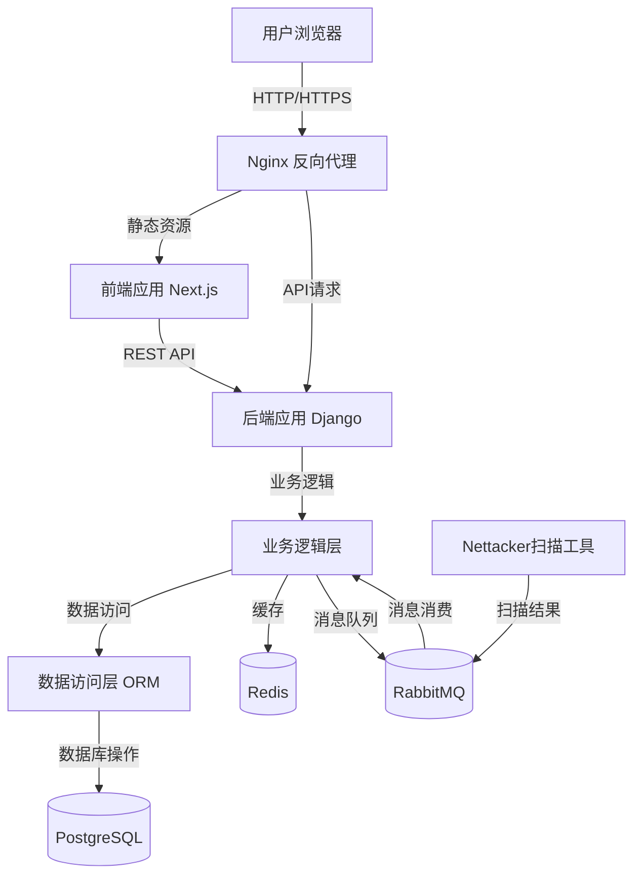
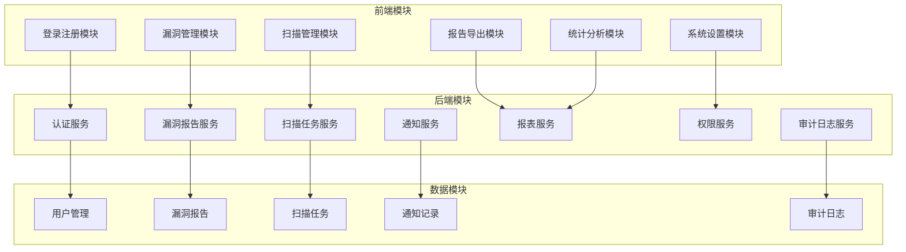
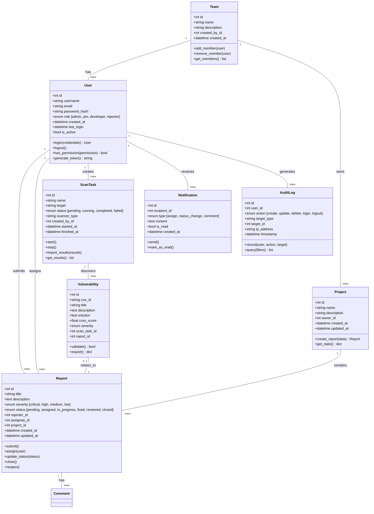
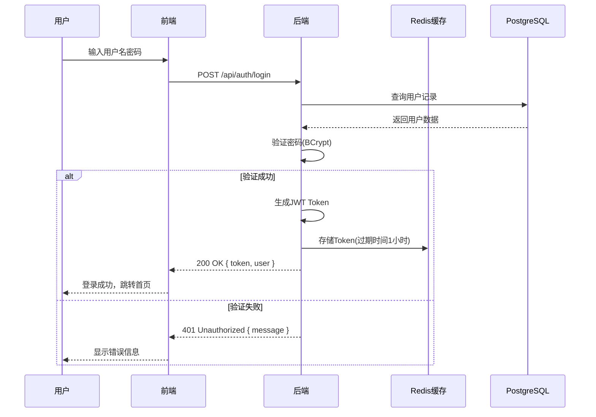
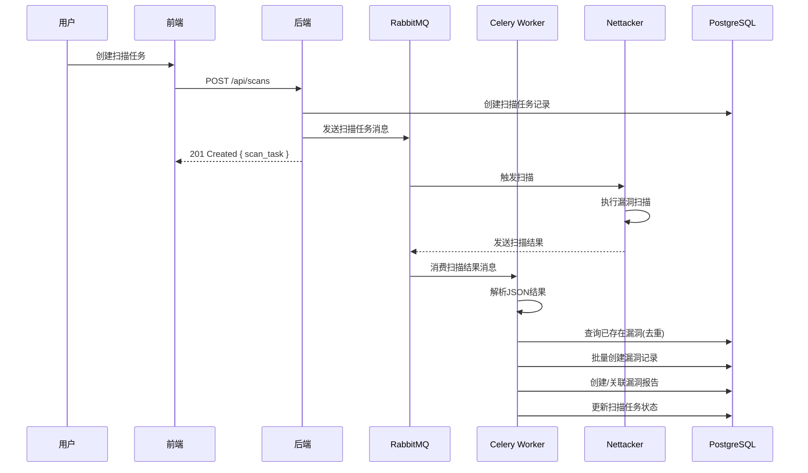
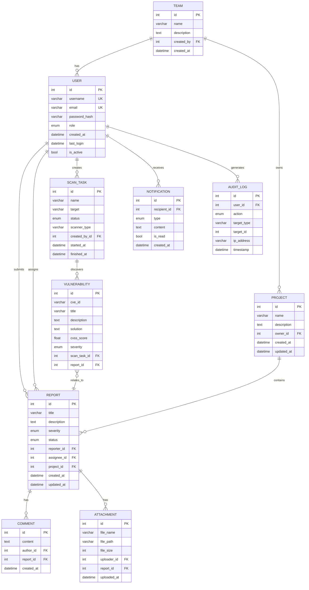
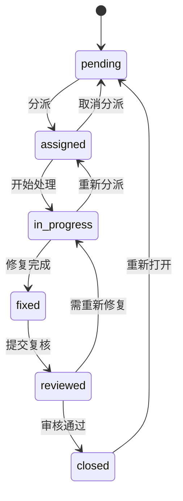

# SecGuard 漏洞管理平台 - 系统架构设计文档

## 版本记录

| 版本 | 日期 | 作者 | 修改说明 |
|------|------|------|----------|
| 1.0 | 2026-05-08 | 团队 | 初始版本 |

---

## 一、需求映射与分层设计

### 1.1 需求-技术实现映射表

| 用户需求 | 功能描述 | 技术实现方案 | AI协作反思 |
|----------|----------|--------------|------------|
| 用户注册/登录 | 用户认证与权限管理 | RESTful API (POST /api/auth/login) + JWT Token + BCrypt密码加密 + PostgreSQL | AI建议使用JWT，我们采纳并增加了Token过期刷新机制，确保安全性 |
| 漏洞上报 | 通过Web表单上报漏洞 | React表单组件 + POST /api/reports + 文件上传(Multipart) + 权限校验 | AI建议使用GraphQL，但考虑到团队熟悉度和项目复杂度，选择RESTful API |
| 漏洞分派 | 分配漏洞处理负责人 | PUT /api/reports/{id}/assign + 站内通知 + 状态流转校验 | AI提供了状态机设计思路，我们根据实际业务调整了状态流转规则 |
| 扫描结果自动导入 | Nettacker扫描结果导入 | 定时任务 + JSON解析 + 漏洞去重算法 + 批量创建报告 | AI建议使用消息队列异步处理，我们采纳并实现了去重逻辑 |
| 报告导出 | PDF/HTML报告生成 | ReportLab/PyPDF2 + Jinja2模板 + 异步任务队列 | AI建议使用第三方服务，但考虑到部署复杂度，选择本地生成方案 |
| 漏洞统计可视化 | 漏洞趋势图表 | ECharts + REST API聚合查询 + Redis缓存 | AI推荐了多种图表库，我们选择了ECharts因其丰富的图表类型 |

### 1.2 分层架构设计

#### 架构分层图



#### 各层职责说明

| 层级 | 名称 | 职责描述 | 技术实现 |
|------|------|----------|----------|
| L1 | 表现层 | 负责UI交互、用户界面展示、前端路由 | React + Next.js + Tailwind CSS |
| L2 | 控制层 | 处理HTTP请求、参数校验、响应封装 | Django Ninja REST Framework |
| L3 | 业务逻辑层 | 核心业务规则处理、权限验证、状态流转 | Python 业务类 |
| L4 | 数据访问层 | 数据库CRUD操作、ORM封装 | Django ORM / SQLAlchemy |
| L5 | 基础设施层 | 缓存、消息队列、日志、定时任务 | Redis、RabbitMQ、Celery |

#### 层间接口规范

**表现层 → 控制层**：REST API 调用，JSON格式数据交换
- 请求格式：`POST /api/reports`，Content-Type: application/json
- 响应格式：`{ "status": "success", "data": {...}, "message": "" }`

**控制层 → 业务逻辑层**：Python方法调用，参数为DTO对象
- 输入：`ReportCreateDTO(title, description, severity, ...)`
- 输出：`ReportResponseDTO(id, title, status, created_at, ...)`

**业务逻辑层 → 数据访问层**：ORM对象操作
- 使用 Django ORM 进行数据库操作
- 事务管理由业务层控制

**业务逻辑层 → 基础设施层**：服务调用接口
- 缓存：`cache.get(key)` / `cache.set(key, value, timeout)`
- 消息队列：`producer.send(queue, message)`

---

## 二、架构设计文档与可视化

### 2.1 UML部署图

```mermaid
deploy
    node "云服务器 (ECS)" as ECS {
        [Nginx] as nginx
        [Next.js Frontend] as frontend
        [Django Backend] as backend
        [Redis Cache] as redis
    }
    
    node "数据库服务器 (RDS)" as RDS {
        [PostgreSQL] as postgres
    }
    
    node "消息队列服务器" as MQ {
        [RabbitMQ] as rabbitmq
        [Celery Worker] as celery
    }
    
    node "扫描工具服务器" as Scanner {
        [Nettacker] as nettacker
    }
    
    actor "用户" as user
    
    user --> nginx
    nginx --> frontend
    nginx --> backend
    backend --> postgres
    backend --> redis
    backend --> rabbitmq
    celery --> rabbitmq
    celery --> postgres
    nettacker --> rabbitmq
```

### 2.2 模块划分图



### 2.3 核心类图（领域模型）



### 2.4 关键时序图

#### 用例1：用户登录



#### 用例2：漏洞扫描与结果导入



---

## 三、技术方案设计

### 3.1 技术选型与工具链

| 分类 | 技术 | 版本 | 选择理由 |
|------|------|------|----------|
| **架构风格** | 前后端分离单体架构 | - | 项目规模适中，单体架构开发效率高，便于团队协作 |
| **前端框架** | React + Next.js | 14.x | 服务端渲染提升首屏性能，路由系统完善，团队熟悉 |
| **前端样式** | Tailwind CSS | 3.x | 原子化CSS，开发效率高，响应式设计方便 |
| **后端框架** | Django + Django Ninja | 5.x | 成熟稳定，ORM强大，Django Ninja提供高性能REST API |
| **数据库** | PostgreSQL | 16.x | 支持JSON类型、全文搜索，安全性高，适合存储漏洞数据 |
| **缓存** | Redis | 7.x | 高性能键值存储，用于Token缓存、热点数据缓存 |
| **消息队列** | RabbitMQ | 3.x | 可靠消息传递，用于扫描任务异步处理 |
| **任务队列** | Celery | 5.x | 分布式任务调度，支持定时任务和异步任务 |
| **容器化** | Docker + Docker Compose | 25.x | 环境统一，一键部署，便于开发和测试 |
| **API文档** | drf-yasg | 1.21.x | 自动生成Swagger/OpenAPI文档 |

### 3.2 数据库设计

#### ER图



#### 数据表结构详情

##### 1. users 表（用户表）

| 字段名 | 类型 | 约束 | 说明 |
|--------|------|------|------|
| id | SERIAL | PRIMARY KEY | 用户唯一标识 |
| username | VARCHAR(150) | UNIQUE, NOT NULL | 用户名 |
| email | VARCHAR(254) | UNIQUE, NOT NULL | 邮箱 |
| password_hash | VARCHAR(128) | NOT NULL | BCrypt加密后的密码 |
| role | VARCHAR(20) | NOT NULL, DEFAULT 'reporter' | 角色：admin/pm/developer/reporter |
| created_at | TIMESTAMP | NOT NULL, DEFAULT CURRENT_TIMESTAMP | 创建时间 |
| last_login | TIMESTAMP | NULL | 最后登录时间 |
| is_active | BOOLEAN | NOT NULL, DEFAULT true | 是否活跃 |

**索引**：
- idx_users_email: 加速邮箱查询
- idx_users_username: 加速用户名查询

##### 2. teams 表（团队表）

| 字段名 | 类型 | 约束 | 说明 |
|--------|------|------|------|
| id | SERIAL | PRIMARY KEY | 团队唯一标识 |
| name | VARCHAR(100) | NOT NULL | 团队名称 |
| description | TEXT | NULL | 团队描述 |
| created_by | INT | NOT NULL, FOREIGN KEY → users(id) | 创建者ID |
| created_at | TIMESTAMP | NOT NULL, DEFAULT CURRENT_TIMESTAMP | 创建时间 |

##### 3. projects 表（项目表）

| 字段名 | 类型 | 约束 | 说明 |
|--------|------|------|------|
| id | SERIAL | PRIMARY KEY | 项目唯一标识 |
| name | VARCHAR(100) | NOT NULL | 项目名称 |
| description | TEXT | NULL | 项目描述 |
| owner_id | INT | NOT NULL, FOREIGN KEY → users(id) | 所有者ID |
| created_at | TIMESTAMP | NOT NULL, DEFAULT CURRENT_TIMESTAMP | 创建时间 |
| updated_at | TIMESTAMP | NOT NULL, DEFAULT CURRENT_TIMESTAMP | 更新时间 |

##### 4. reports 表（漏洞报告表）

| 字段名 | 类型 | 约束 | 说明 |
|--------|------|------|------|
| id | SERIAL | PRIMARY KEY | 报告唯一标识 |
| title | VARCHAR(255) | NOT NULL | 漏洞标题 |
| description | TEXT | NOT NULL | 漏洞描述 |
| severity | VARCHAR(20) | NOT NULL | 严重程度：critical/high/medium/low |
| status | VARCHAR(20) | NOT NULL, DEFAULT 'pending' | 状态：pending/assigned/in_progress/fixed/reviewed/closed |
| reporter_id | INT | NOT NULL, FOREIGN KEY → users(id) | 报告者ID |
| assignee_id | INT | NULL, FOREIGN KEY → users(id) | 负责人ID |
| project_id | INT | NOT NULL, FOREIGN KEY → projects(id) | 关联项目ID |
| created_at | TIMESTAMP | NOT NULL, DEFAULT CURRENT_TIMESTAMP | 创建时间 |
| updated_at | TIMESTAMP | NOT NULL, DEFAULT CURRENT_TIMESTAMP | 更新时间 |

**索引**：
- idx_reports_status: 按状态筛选
- idx_reports_severity: 按严重程度筛选
- idx_reports_project: 按项目筛选
- idx_reports_reporter: 按报告者筛选

##### 5. scan_tasks 表（扫描任务表）

| 字段名 | 类型 | 约束 | 说明 |
|--------|------|------|------|
| id | SERIAL | PRIMARY KEY | 任务唯一标识 |
| name | VARCHAR(100) | NOT NULL | 任务名称 |
| target | VARCHAR(500) | NOT NULL | 扫描目标 |
| status | VARCHAR(20) | NOT NULL, DEFAULT 'pending' | 状态：pending/running/completed/failed |
| scanner_type | VARCHAR(50) | NOT NULL | 扫描器类型 |
| created_by_id | INT | NOT NULL, FOREIGN KEY → users(id) | 创建者ID |
| started_at | TIMESTAMP | NULL | 开始时间 |
| finished_at | TIMESTAMP | NULL | 结束时间 |

##### 6. vulnerabilities 表（漏洞信息表）

| 字段名 | 类型 | 约束 | 说明 |
|--------|------|------|------|
| id | SERIAL | PRIMARY KEY | 漏洞唯一标识 |
| cve_id | VARCHAR(50) | NULL | CVE编号 |
| title | VARCHAR(255) | NOT NULL | 漏洞标题 |
| description | TEXT | NOT NULL | 漏洞描述 |
| solution | TEXT | NULL | 修复建议 |
| cvss_score | FLOAT | NULL | CVSS评分 |
| severity | VARCHAR(20) | NOT NULL | 严重程度 |
| scan_task_id | INT | NOT NULL, FOREIGN KEY → scan_tasks(id) | 关联扫描任务 |
| report_id | INT | NULL, FOREIGN KEY → reports(id) | 关联漏洞报告 |

**索引**：
- idx_vulnerabilities_cve: CVE编号索引
- idx_vulnerabilities_scan: 扫描任务索引

##### 7. comments 表（评论表）

| 字段名 | 类型 | 约束 | 说明 |
|--------|------|------|------|
| id | SERIAL | PRIMARY KEY | 评论唯一标识 |
| content | TEXT | NOT NULL | 评论内容 |
| author_id | INT | NOT NULL, FOREIGN KEY → users(id) | 作者ID |
| report_id | INT | NOT NULL, FOREIGN KEY → reports(id) | 关联报告 |
| created_at | TIMESTAMP | NOT NULL, DEFAULT CURRENT_TIMESTAMP | 创建时间 |

##### 8. attachments 表（附件表）

| 字段名 | 类型 | 约束 | 说明 |
|--------|------|------|------|
| id | SERIAL | PRIMARY KEY | 附件唯一标识 |
| file_name | VARCHAR(255) | NOT NULL | 文件名 |
| file_path | VARCHAR(500) | NOT NULL | 文件路径 |
| file_size | INT | NOT NULL | 文件大小(字节) |
| uploader_id | INT | NOT NULL, FOREIGN KEY → users(id) | 上传者ID |
| report_id | INT | NOT NULL, FOREIGN KEY → reports(id) | 关联报告 |
| uploaded_at | TIMESTAMP | NOT NULL, DEFAULT CURRENT_TIMESTAMP | 上传时间 |

##### 9. notifications 表（通知表）

| 字段名 | 类型 | 约束 | 说明 |
|--------|------|------|------|
| id | SERIAL | PRIMARY KEY | 通知唯一标识 |
| recipient_id | INT | NOT NULL, FOREIGN KEY → users(id) | 接收者ID |
| type | VARCHAR(20) | NOT NULL | 类型：assign/status_change/comment |
| content | TEXT | NOT NULL | 通知内容 |
| is_read | BOOLEAN | NOT NULL, DEFAULT false | 是否已读 |
| created_at | TIMESTAMP | NOT NULL, DEFAULT CURRENT_TIMESTAMP | 创建时间 |

**索引**：
- idx_notifications_recipient: 按接收者筛选
- idx_notifications_unread: 未读通知索引

##### 10. audit_logs 表（审计日志表）

| 字段名 | 类型 | 约束 | 说明 |
|--------|------|------|------|
| id | SERIAL | PRIMARY KEY | 日志唯一标识 |
| user_id | INT | NOT NULL, FOREIGN KEY → users(id) | 用户ID |
| action | VARCHAR(20) | NOT NULL | 操作类型：create/update/delete/login/logout |
| target_type | VARCHAR(50) | NOT NULL | 目标类型：report/user/project等 |
| target_id | INT | NULL | 目标ID |
| ip_address | VARCHAR(50) | NULL | IP地址 |
| timestamp | TIMESTAMP | NOT NULL, DEFAULT CURRENT_TIMESTAMP | 时间戳 |

**索引**：
- idx_audit_user: 按用户筛选
- idx_audit_timestamp: 按时间筛选

### 3.3 关键算法与原型实现

#### 3.3.1 漏洞去重算法

**算法设计**：
- 基于CVE ID进行精确匹配
- 基于漏洞标题和描述进行模糊匹配（Jaccard相似度）
- 相似度阈值：≥80%判定为重复

**伪代码**：

```python
def deduplicate_vulnerabilities(new_vuln, existing_vulns):
    """
    漏洞去重算法
    :param new_vuln: 新漏洞对象
    :param existing_vulns: 已存在漏洞列表
    :return: 是否重复, 重复的漏洞ID
    """
    
    # 1. CVE ID精确匹配
    if new_vuln.cve_id:
        for vuln in existing_vulns:
            if vuln.cve_id == new_vuln.cve_id:
                return True, vuln.id
    
    # 2. Jaccard相似度匹配
    for vuln in existing_vulns:
        similarity = jaccard_similarity(
            new_vuln.title + " " + new_vuln.description,
            vuln.title + " " + vuln.description
        )
        if similarity >= 0.8:
            return True, vuln.id
    
    return False, None

def jaccard_similarity(str1, str2):
    """计算两个字符串的Jaccard相似度"""
    set1 = set(str1.lower().split())
    set2 = set(str2.lower().split())
    intersection = len(set1 & set2)
    union = len(set1 | set2)
    return intersection / union if union > 0 else 0
```

**算法复杂度分析**：
- 时间复杂度：O(n)，n为已存在漏洞数量
- 空间复杂度：O(1)，仅使用常数额外空间

#### 3.3.2 技术原型实现

**原型用例1：用户登录**

API端点：`POST /api/auth/login`

请求体：
```json
{
    "username": "string",
    "password": "string"
}
```

响应体（成功）：
```json
{
    "status": "success",
    "data": {
        "user": {
            "id": 1,
            "username": "admin",
            "email": "admin@example.com",
            "role": "admin"
        },
        "token": "eyJhbGciOiJIUzI1NiIsInR5cCI6IkpXVCJ9..."
    }
}
```

响应体（失败）：
```json
{
    "status": "error",
    "message": "用户名或密码错误"
}
```

**原型用例2：漏洞上报**

API端点：`POST /api/reports`

请求体：
```json
{
    "title": "SQL注入漏洞",
    "description": "在登录页面发现SQL注入漏洞，可绕过认证",
    "severity": "critical",
    "project_id": 1,
    "steps": ["步骤1", "步骤2"],
    "attachments": [{"file_name": "poc.png", "file_path": "/uploads/poc.png"}]
}
```

响应体（成功）：
```json
{
    "status": "success",
    "data": {
        "id": 1001,
        "title": "SQL注入漏洞",
        "status": "pending",
        "created_at": "2026-05-08T10:30:00Z"
    }
}
```

**原型用例3：扫描任务创建**

API端点：`POST /api/scans`

请求体：
```json
{
    "name": "网站安全扫描",
    "target": "https://example.com",
    "scanner_type": "nettacker"
}
```

响应体（成功）：
```json
{
    "status": "success",
    "data": {
        "id": 1,
        "name": "网站安全扫描",
        "status": "pending",
        "created_at": "2026-05-08T10:35:00Z"
    }
}
```

---

## 四、编码规范

### 4.1 代码风格规范

#### 4.1.1 Python/Django 编码规范

**命名规则**：
- 类名：大驼峰式（PascalCase），如 `ReportService`
- 方法/函数名：小驼峰式（camelCase），如 `create_report`
- 变量名：下划线分隔（snake_case），如 `user_id`
- 常量名：全大写+下划线分隔，如 `MAX_FILE_SIZE`

**缩进与换行**：
- 使用4空格缩进
- 每行不超过120字符
- 二元运算符前后加空格

**注释规范**：
- 模块开头：文件说明、作者、版本
- 类/方法：功能说明、参数、返回值
- 复杂逻辑：关键步骤注释

**示例**：
```python
"""
漏洞报告服务模块
处理漏洞报告的业务逻辑
"""

class ReportService:
    """漏洞报告服务类"""
    
    def create_report(self, data: dict) -> Report:
        """
        创建漏洞报告
        
        Args:
            data: 报告数据字典
            
        Returns:
            创建的报告对象
        """
        # 验证数据
        self._validate_data(data)
        
        # 创建报告
        report = Report.objects.create(
            title=data['title'],
            description=data['description'],
            severity=data['severity'],
            reporter_id=data['reporter_id'],
            project_id=data['project_id']
        )
        
        return report
```

#### 4.1.2 JavaScript/React 编码规范

**命名规则**：
- 组件名：大驼峰式，如 `ReportForm`
- 函数/方法名：小驼峰式，如 `handleSubmit`
- 变量名：小驼峰式，如 `isLoading`
- 文件命名：大驼峰式（组件）或小驼峰式（工具函数）

**缩进与换行**：
- 使用2空格缩进
- 每行不超过120字符
- JSX标签属性换行时对齐

**注释规范**：
- 组件开头：组件功能说明
- 复杂逻辑：关键步骤注释

**示例**：
```jsx
/**
 * 漏洞报告表单组件
 * 用于提交新的漏洞报告
 */
const ReportForm = ({ onSubmit }) => {
    const [formData, setFormData] = useState({
        title: '',
        description: '',
        severity: 'medium'
    });
    
    /**
     * 处理表单提交
     */
    const handleSubmit = async (e) => {
        e.preventDefault();
        
        try {
            await api.post('/api/reports', formData);
            onSubmit();
        } catch (error) {
            console.error('提交失败:', error);
        }
    };
    
    return (
        <form onSubmit={handleSubmit}>
            {/* 表单内容 */}
        </form>
    );
};
```

### 4.2 代码设计规范

#### 设计原则

1. **单一职责原则**：每个类/方法只做一件事
2. **依赖倒置原则**：面向接口编程，依赖抽象而非具体实现
3. **开闭原则**：对扩展开放，对修改关闭
4. **接口隔离原则**：使用多个专门的接口而非单一总接口

#### 异常处理规范

- 定义统一异常类：`AppError`, `ValidationError`, `AuthenticationError`
- 全局异常处理器：统一捕获并返回标准格式错误响应
- 错误响应格式：
```json
{
    "status": "error",
    "code": 400,
    "message": "参数验证失败",
    "details": ["title字段不能为空"]
}
```

#### 日志规范

| 级别 | 使用场景 | 示例 |
|------|----------|------|
| DEBUG | 详细调试信息 | 函数参数、返回值 |
| INFO | 重要业务操作 | 用户登录、报告创建 |
| WARNING | 潜在问题 | 过期Token尝试、权限不足 |
| ERROR | 错误但不影响系统运行 | API调用失败、数据库操作异常 |
| CRITICAL | 严重错误 | 服务不可用、数据丢失 |

---

## 五、AI协作反思

### 5.1 AI方案的批判性分析

**优点**：
- AI提供了完整的技术方案框架，节省了大量调研时间
- AI推荐的技术栈符合项目需求，与团队技术栈匹配度高
- AI生成的UML图结构清晰，类关系定义合理

**不足**：
- AI建议使用GraphQL，但团队更熟悉RESTful API
- AI推荐的微服务架构过于复杂，不适合本项目规模
- 数据库设计存在过度规范化问题，部分表可以合并

**潜在风险**：
- AI建议的加密算法可能过时（如MD5），需要验证
- AI生成的代码可能存在安全漏洞，需要人工审查
- AI对业务逻辑的理解可能不准确，需要验证

### 5.2 团队改进与创新

1. **架构选型优化**：
   - 拒绝AI建议的微服务架构，采用单体架构
   - 选择RESTful API而非GraphQL，降低学习成本

2. **安全增强**：
   - 将AI建议的SHA-256替换为BCrypt进行密码存储
   - 增加Token过期刷新机制
   - 实现完整的权限校验体系

3. **性能优化**：
   - 引入Redis缓存热点数据
   - 使用RabbitMQ异步处理扫描任务
   - 数据库查询优化，添加适当索引

4. **代码质量**：
   - 制定严格的编码规范
   - 使用代码审查工具（SonarLint）
   - 编写单元测试和集成测试

### 5.3 协作心得

- AI是强大的辅助工具，但不能替代人工判断
- 需要对AI输出进行批判性分析，不能盲目采纳
- 将AI作为创意来源，结合团队实际情况进行调整
- 定期审查AI生成的代码，确保安全性和质量

---

## 六、附录

### A. 状态流转图



### B. 安全设计要点

| 安全风险 | 防范措施 |
|----------|----------|
| SQL注入 | 使用ORM框架，参数化查询 |
| XSS攻击 | 前端转义、后端过滤、CSP配置 |
| 密码泄露 | BCrypt加密存储，禁止明文传输 |
| 未授权访问 | JWT认证、RBAC权限控制 |
| CSRF攻击 | CSRF Token验证 |
| 文件上传漏洞 | 文件类型校验、路径白名单、文件大小限制 |
| 敏感信息泄露 | 日志脱敏、响应数据过滤 |

---

**文档版本**：v1.0  
**创建日期**：2026年5月8日  
**团队**：随便吧！