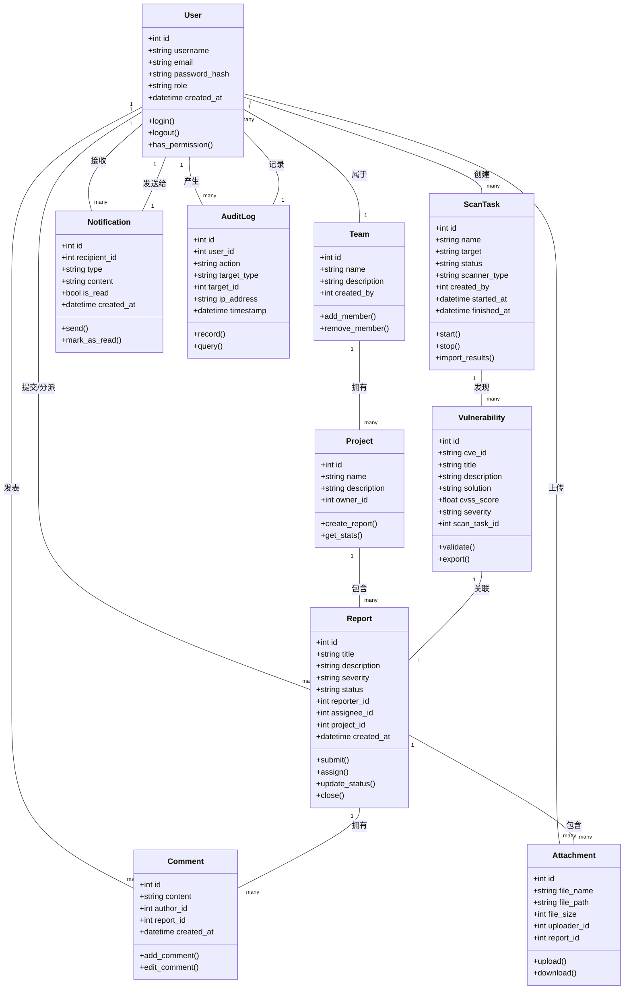

## 1. 引言

### 1.1 项目背景
OWASP BLT是一个开源的漏洞猎捕与日志记录平台，但存在以下问题：
- 界面较为陈旧，用户体验不佳
- 缺少自动化扫描集成能力
- 报告导出功能不够完善
- 部署流程复杂

### 1.2 项目目标
基于OWASP BLT进行二次开发，打造一个轻量化、自动化、可协作的漏洞管理与跟踪平台（SecGuard）。

### 1.3 项目范围
- 漏洞上报、分派、修复、复核、关闭的完整闭环管理
- 集成Nettacker扫描工具，实现结果自动导入
- 增加统计报表和报告导出功能
- 优化前端界面和交互体验

### 1.4 术语定义
| 术语 | 定义 |
|------|------|
| BLT | Bug Logging Tool，漏洞日志记录工具 |
| OWASP | Open Web Application Security Project |
| CVE | Common Vulnerabilities and Exposures |
| CVSS | Common Vulnerability Scoring System |
| MVP | Minimum Viable Product，最小可行产品 |
| WBS | Work Breakdown Structure，工作分解结构 |

## 2. 用户场景

### 2.1 用户角色
| 角色 | 描述 | 核心需求 |
|------|------|----------|
| 安全团队成员 | 负责漏洞发现和上报 | 快速上报漏洞、跟踪处理进度 |
| 团队负责人/PM | 负责漏洞分派和审核 | 查看整体状态、生成报告 |
| 开发人员 | 负责漏洞修复 | 接收修复任务、更新状态 |

### 2.2 用户故事

#### 故事1：漏洞上报
> 作为**安全测试人员**，我希望**能够通过Web表单快速上报发现的漏洞**，以便**让团队及时了解安全问题并安排修复**。

**验收条件**：
- 表单包含：漏洞标题、描述、严重程度、影响范围、复现步骤
- 支持上传附件（POC代码、截图）
- 提交后自动生成唯一漏洞ID
- 提交成功后自动通知团队负责人

#### 故事2：漏洞跟踪
> 作为**团队负责人**，我希望**能够查看所有漏洞的处理状态和进度**，以便**掌握整体安全状况并进行资源调配**。

**验收条件**：
- 漏洞列表支持按状态筛选（待分派/处理中/已修复/已关闭）
- 显示每个漏洞的处理时长
- 支持按严重程度排序

#### 故事3：扫描结果自动导入
> 作为**安全运维人员**，我希望**Nettacker扫描工具的结果能自动导入平台**，以便**减少手动录入的工作量**。

**验收条件**：
- 支持Nettacker扫描报告（JSON格式）导入
- 自动解析漏洞信息并创建漏洞报告
- 去重检测，避免重复创建

#### 故事4：报告导出
> 作为**团队负责人**，我希望**能够导出安全报告**，以便**向指导老师或管理层汇报工作成果**。

**验收条件**：
- 支持导出PDF/HTML格式
- 报告包含：漏洞统计、修复率、处理时长分析

## 3. 核心类图

### 3.1 实体类定义

| 类名 | 属性 | 方法 | 说明 |
|------|------|------|------|
| User | id, username, email, password_hash, role, avatar, created_at, last_login | login(), logout(), has_permission() | 系统用户 |
| Team | id, name, description, created_by, created_at | add_member(), remove_member() | 团队 |
| Project | id, name, description, owner_id, created_at, updated_at | create_report(), get_stats() | 项目 |
| Report | id, title, description, severity, status, reporter_id, assignee_id, project_id, created_at, updated_at | submit(), assign(), update_status(), close() | 漏洞报告 |
| Comment | id, content, author_id, report_id, created_at | add_comment(), edit_comment() | 评论 |
| Attachment | id, file_name, file_path, file_size, uploader_id, report_id, uploaded_at | upload(), download() | 附件 |
| ScanTask | id, name, target, status, scanner_type, created_by, started_at, finished_at | start(), stop(), import_results() | 扫描任务 |
| Vulnerability | id, cve_id, title, description, solution, cvss_score, severity, scan_task_id | validate(), export() | 漏洞信息 |
| Notification | id, recipient_id, type, content, is_read, created_at | send(), mark_as_read() | 通知 |
| AuditLog | id, user_id, action, target_type, target_id, ip_address, timestamp | record(), query() | 审计日志 |

### 3.2 类关系图（Mermaid格式）



### 3.3 实体关系说明

#### 核心关系

| 源实体 | 目标实体 | 关系类型 | 说明 |
|--------|----------|----------|------|
| User | Report | 一对多 | 一个用户可以提交多个漏洞报告 |
| User | Comment | 一对多 | 一个用户可以发表多条评论 |
| User | ScanTask | 一对多 | 一个用户可以创建多个扫描任务 |
| Report | Comment | 一对多 | 一个报告可以有多条评论 |
| Report | Attachment | 一对多 | 一个报告可以有多个附件 |
| ScanTask | Vulnerability | 一对多 | 一个扫描任务可以发现多个漏洞 |
| Vulnerability | Report | 一对一 | 一个漏洞可以关联一个报告 |

#### 状态流转

漏洞报告的状态流转如下：

```
待分派 → 处理中 → 已修复 → 已复核 → 已关闭
   ↑         ↓          ↓
   └───── 重新打开 ←────┘
```

| 状态 | 说明 | 可执行操作 |
|------|------|------------|
| 待分派 | 报告已提交，等待分配负责人 | 分派、删除 |
| 处理中 | 已分配负责人，正在修复 | 修复、重新分派 |
| 已修复 | 开发人员已完成修复 | 复核、重新打开 |
| 已复核 | 测试人员已验证修复 | 关闭、重新打开 |
| 已关闭 | 漏洞已确认修复完成 | 重新打开 |

### 3.4 类图设计说明

1. **用户角色设计**：User类中的role字段支持admin、pm、developer、reporter四种角色，不同角色拥有不同权限。

2. **漏洞严重程度**：severity字段包括critical、high、medium、low四个级别。

3. **扫描集成**：ScanTask和Vulnerability类支持Nettacker等扫描工具的结果导入。

4. **审计追踪**：AuditLog类记录所有关键操作，满足安全审计要求。

## 4. 功能描述

### 4.1 MVP核心功能（第6-10周必须完成）

| 优先级 | 功能模块 | 功能点 | 说明 |
|--------|----------|--------|------|
| P0 | 用户认证 | 登录/注册/权限管理 | 基于Django Auth |
| P0 | 漏洞上报 | 表单提交/附件上传 | 核心业务流程 |
| P0 | 漏洞管理 | 列表/详情/状态流转 | CRUD操作 |
| P0 | 漏洞分派 | 指定负责人 | 状态：待分派→处理中 |
| P1 | 扫描集成 | Nettacker结果导入 | 自动化导入 |

### 4.2 扩展功能（后续迭代）

| 优先级 | 功能模块 | 功能点 |
|--------|----------|--------|
| P2 | 统计分析 | 漏洞趋势图/修复率统计 |
| P2 | 报告导出 | PDF/HTML报告生成 |
| P3 | 通知提醒 | 邮件/站内信通知 |

## 5. 验收标准

| 功能 | 验收条件 |
|------|----------|
| 用户登录 | 登录成功率达到100%，密码加密存储 |
| 漏洞上报 | 表单提交成功率≥99%，必填项校验完整 |
| 漏洞列表 | 加载时间<2秒，支持分页 |
| 状态流转 | 状态变更记录日志，权限校验正确 |
| 扫描导入 | 支持JSON格式导入，去重准确率≥95% |
| 报告导出 | PDF生成时间<5秒，包含完整数据 |

## 6. 人机协作记录

详见单独文件：[人机协作记录.md](./人机协作记录.md)